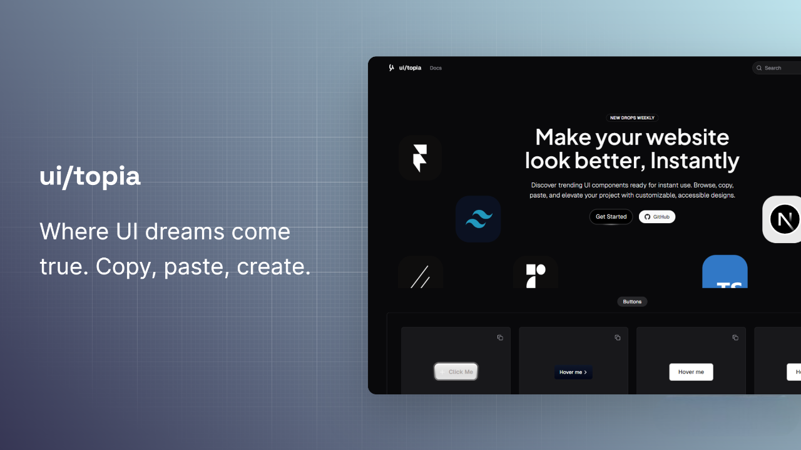

### UITOPIA
### An collection of fine-ui components.

  

 

### Check out some dope project for delightful enhancement your websites

	

### UI Library

| Title                                                       | Description            |
| ----------------------------------------------------------- | ---------------------- |
| [MagicUI](https://ui.aceternity.com/)                       | UI library for Design Engineers.          |
| [AceternityUI](https://ui.aceternity.com/)                  | Beautifully trending components. |
| [lukacho-ui](https://ui.lukacho.com)                        | Next Generation UI Components.    |
| [Motion Primitive](https://motion-primitives.com/)          | A curated collection of reusable animated components.      |
| [SyntaxUI](https://syntaxui.com/)                           | Free-to-use UI elements designed for rapid development. |
| [cult/ui](https://www.cult-ui.com/)                         | A well curated set of animated shadcn-style React components for more specific use-cases.   |
| [animata-design](https://animata.design/)                   | Hand-crafted ✍️ interaction animations and effects from around the internet.            |
| [Variant Vault](https://variantvault.chrisabdo.dev/)        | Framer Motion text variants.  |
| [Justd](https://getjustd.com/)                              | A chill set of React components, built on top of React Aria Components.  |

 

### Tailwind Utilities      

| Title                                                       | Description            |
| ----------------------------------------------------------- | ---------------------- |
| [fluid-tailwind](packages/api-client/README.md)             | Scale utilities smoothly between breakpoints with CSS clamp().          |

 

### Colors and Customizations

| Title                                                       | Description            |
| ----------------------------------------------------------- | ---------------------- |
| [10000+Themes for shadcn/ui](https://ui.jln.dev/)           |  10000+ Themes for shadcn/ui.          |

 

### Stats

